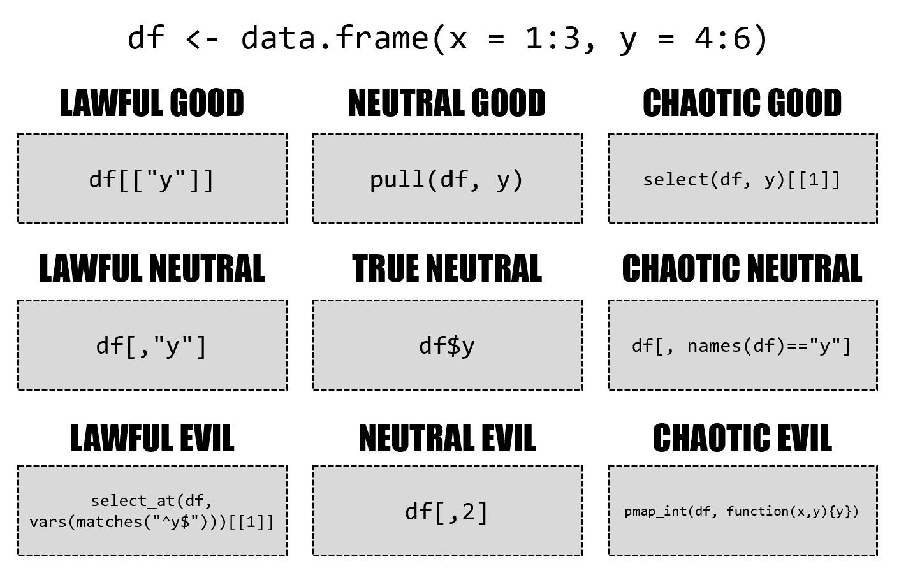

<style type="text/css">
.dftbl {
    width: 100%;
    table-layout: fixed;
    display: inline-table;
}

.error pre code {
    color: red;
}

.warning pre code {
    color: violet;
}
</style>

```{r, include = FALSE}
knitr::opts_chunk$set(
  error = TRUE,
  collapse = TRUE,
  comment = "#>"
)

tibble:::set_dftbl_hooks()

options(
  lifecycle_disable_warnings = FALSE,
  lifecycle_verbose_soft_deprecation = TRUE,
  lifecycle_repeat_warnings = TRUE
)
```

There are many, many ways to subset data frames and tibbles.

<figure>
[{ width=100% }](https://twitter.com/skyetetra/status/1160012260456062977)
<figcaption>
Drawing by [Jacqueline Nolis](https://twitter.com/skyetetra/status/1160012260456062977)
</figcaption>
</figure>

This vignette is an attempt to provide a comprehensive overview over the behavior of the subsetting operators `$`, `[[` and `[`, highlighting where the tibble implementation differs from the data frame implementation.

```{r setup}
library(tibble)

new_df <- function() {
  df <- data.frame(a = 1:4)
  df$b <- letters[5:8]
  df$cd <- list(9, 10:11, 12:14, "text")
  df
}

new_tbl <- function() {
  as_tibble(new_df())
}
```

Results of the same code for data frames and tibbles are presented side by side:

```{r show, dftbl = TRUE, dftbl_always = TRUE}
new_df()
```

In the following, if the results are identical (after converting to a data frame if necessary), only the tibble result is shown, as in the example below.
This allows to spot differences easier.

```{r show-compare, dftbl = TRUE}
new_df()
```

Subsetting operations are read-only.
The same objects are reused in all examples:

```{r ro}
df <- new_df()
tbl <- new_tbl()
```

## $

With `$` subsetting, accessing a missing column gives a warning.
Inexact matching is not supported:

```{r dollar, dftbl = TRUE}
df$a
df$"a"
df$a[2:3]
df$cd
df$c
df$d
```

## [[

The `exact` argument is not supported by tibbles.

```{r double-bracket-col, dftbl = TRUE}
df[["a"]]
df[["cd", exact = TRUE]]
df[["cd", exact = FALSE]]
df[["c", exact = TRUE]]
df[["c", exact = FALSE]]
```

With two indexes, a single element is returned.
List columns are not unpacked by tibbles, the `[[` only unpacks columns.

```{r double-bracket-both, dftbl = TRUE}
df[[2, "a"]]
df[[2, "cd"]]
df[[1:2, "cd"]]
df[[2, "c"]]
df[[1:2, "c"]]
```

Exotic variants like recursive indexing are deprecated for tibbles.

```{r double-bracket-exotic, dftbl = TRUE}
df[[c(1, 2)]]
```

## [

With `[` subsetting, tibbles always return a tibble.
The `drop` argument is supported but has different defaults:

```{r bracket-col-one, dftbl = TRUE}
df["a"]
df["a", drop = FALSE]
df["a", drop = TRUE]
df[1]
df[0]
df[4]
df[NA]
df[NA_character_]
df[NA_integer_]
```

The same examples are repeated for two-dimensional indexing when omitting the row index:


```{r bracket-col-two, dftbl = TRUE}
df[, "a"]
df[, "a", drop = FALSE]
df[, "a", drop = TRUE]
df[, 1]
df[, 0]
df[, 4]
df[, NA]
df[, NA_character_]
df[, NA_integer_]
```

Multiple columns can be queried by passing a vector of column indexes (names, positions, or even a logical vector).
With the latter option, tibbles are a tad stricter:

```{r bracket-col-multi-one, dftbl = TRUE}
df[c("a", "b")]
df[character()]
df[1:2]
df[1:3]
df[1:4]
df[0:2]
df[-1:2]
df[-1]
df[-(1:2)]
df[integer()]
df[TRUE]
df[FALSE]
df[c(TRUE, TRUE, FALSE)]
df[c(FALSE, TRUE, FALSE)]
df[c(FALSE, TRUE)]
df[c(FALSE, TRUE, FALSE, TRUE)]
```

The same examples are repeated for two-dimensional indexing when omitting the row index:

```{r bracket-col-multi-two, dftbl = TRUE}
df[, c("a", "b")]
df[, character()]
df[, 1:2]
df[, 1:3]
df[, 1:4]
df[, 0:2]
df[, -1:2]
df[, -1]
df[, -(1:2)]
df[, integer()]
df[, TRUE]
df[, FALSE]
df[, c(TRUE, TRUE, FALSE)]
df[, c(FALSE, TRUE, FALSE)]
df[, c(FALSE, TRUE)]
df[, c(FALSE, TRUE, FALSE, TRUE)]
```

Row subsetting with integer indexes works almost identical.
Out-of-bounds subsetting is not recommended and may lead to an error in future versions.
Another special case is subsetting with `[1, , drop = TRUE]` where the data frame implementation returns a list.

```{r bracket-row-integer, dftbl = TRUE}
df[1, ]
df[1, , drop = TRUE]
df[1:2, ]
df[0, ]
df[integer(), ]
df[5, ]
df[4:5, ]
df[-1, ]
df[-1:2, ]
df[NA, ]
df[NA_integer_, ]
df[c(NA, 1), ]
```

Row subsetting with logical indexes also works almost identical, the index vector must have length one or the number of rows with tibbles.

```{r bracket-row-logical, dftbl = TRUE}
df[TRUE, ]
df[FALSE, ]
df[c(TRUE, FALSE), ]
df[c(TRUE, FALSE, TRUE), ]
df[c(TRUE, FALSE, TRUE, FALSE), ]
df[c(TRUE, FALSE, TRUE, FALSE, TRUE), ]
```

Indexing both row and column works more or less the same, except for `drop`:

```{r bracket-both, dftbl = TRUE}
df[1, "a"]
df[1, "a", drop = FALSE]
df[1, "a", drop = TRUE]
df[1:2, "a"]
df[1:2, "a", drop = FALSE]
df[1:2, "a", drop = TRUE]
df[1, c("a", "b")]
df[1, c("a", "b"), drop = FALSE]
df[1, c("a", "b"), drop = TRUE]
df[1:2, c("a", "b")]
```

Indexes can be omitted altogether, no differences here:

```{r bracket-empty, dftbl = TRUE}
df[]
df[, ]
```
